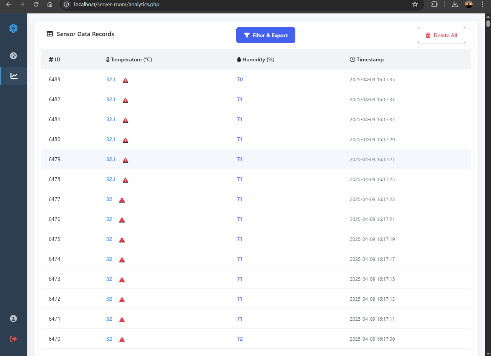
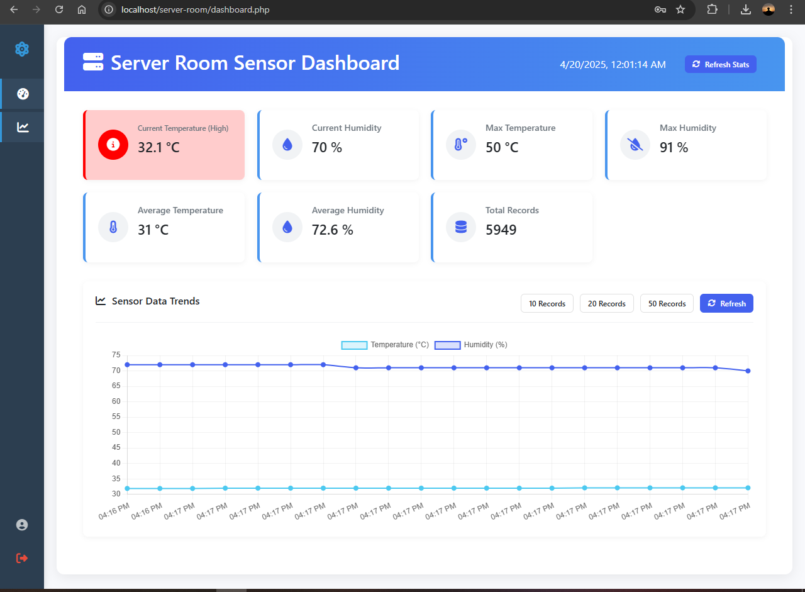
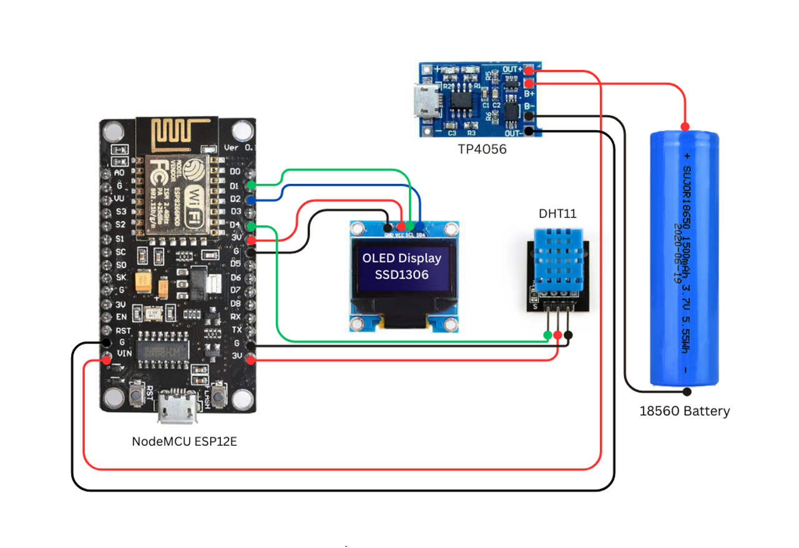

# ESP8266 Server Room Monitor

A Wi-Fi-based temperature and humidity monitoring system using the ESP8266 and DHT11 sensor. Data is shown on an OLED display and can be accessed via a local web server. In case of failed data transmission, readings are stored in the ESP8266's internal file system (LittleFS) and resent later.

## 📦 Features

- Reads temperature and humidity using DHT11
- Displays data on SSD1306 OLED
- Hosts a web server in Access Point (AP) mode
- Sends data to an HTTP server
- Stores failed data in `LittleFS` and retries
- Simple web API for reading or deleting failed data logs

---

## 📷 Screenshots of Web Application

## 🔌 Pin Configuration

| Component       | Description                      | ESP8266 Pin |
|----------------|----------------------------------|-------------|
| DHT11 Sensor   | Temperature and humidity sensor  | D4 (GPIO2)  |
| OLED Display   | SSD1306 I2C                      | SDA: D2 (GPIO4), SCL: D1 (GPIO5) |
| Built-in LED   | Status indication                | D0 (GPIO16) |

> 📌 **Note:** Make sure your OLED is wired for I2C with address `0x3C`.

---

## 📷 Schematic Diagram

## 🌐 Wi-Fi Configuration

- **Mode:** Access Point (AP)
- **SSID:** `Server_Monitoring_AP`
- **Password:** `cuadra1234`
- **Default IP:** `192.168.4.1`

---

## 📁 API Endpoints

| Endpoint       | Method | Description                          |
|----------------|--------|--------------------------------------|
| `/index.php`   | GET    | Returns latest temp & humidity (JSON)|
| `/data`        | GET    | Returns contents of failed data file |
| `/delete`      | GET    | Deletes the failed data file         |

---

## 🛠️ Libraries Used

- `ESP8266WiFi.h`
- `WiFiClient.h`
- `ESP8266HTTPClient.h`
- `ESP8266WebServer.h`
- `LittleFS.h`
- `DHT.h`
- `Adafruit_GFX.h`
- `Adafruit_SSD1306.h`
- `Adafruit_Sensor.h`

---

## 📝 Notes

- This project is set up for **DHT11**. For **DHT22**, change the `DHTTYPE`.
- If the HTTP server is unreachable, the data is appended to `/failed_data.txt` in LittleFS.
- The web server allows you to manually check or delete the stored data.

---

## 🧠 Future Improvements

- Add more sensor support (e.g., MQ sensors, PIR)

---

## 💡 Author

> Created by a passionate hardware tinkerer. 😊

